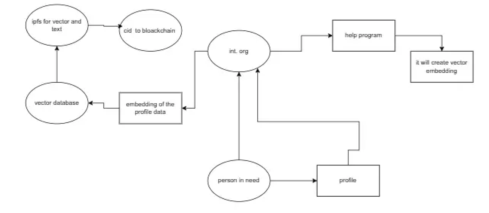
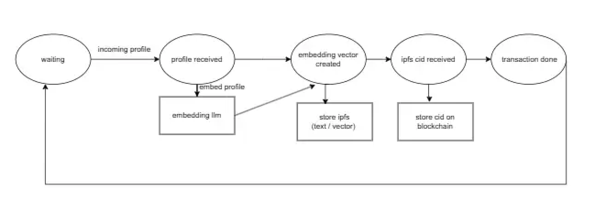
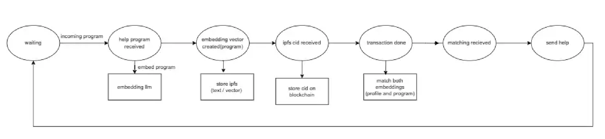

# Project Machu Picchu-*Wonderful Life*
## Executive Summary
*Wonderful Life* is a sub-project of *Machu Picchu*, an open-source collaborative humanitarian project. *Wonderful Life* simulates how persons in need of similar profiles can help themselves mutually.

*Wonderful Life* is an entry to the 2025 hackathon ETH Global *Agentic Ethereum*. It is a rough sketch that shows an agent that receive profiles of **Persons in need**, make embeddings of these profiles and stores the profile in IPFS, as well as the embedding vector. Both IPFS hashes are stored in the blockchain for notarial purposes and for other Inclusive Finance purposes. Another agent, or the same agent, is used to match the purposes of a Humanitarian Helper Project Sheet with potential candidates to be helped.

The complete scenario is told in a DeepSeek chatbot session https://github.com/kvutien/Doc-Simulated_profiles_Persons_in_Need/blob/main/Profile_prompt.md

- Machu Picchu's White paper is here: https://github.com/kvutien/Project-Machu_Picchu_White_Paper_2024
- Machu Picchu is explained in this 10 minutes video podcast: https://youtu.be/z1ylfi60ES0

## Quick Look
### Overall View

There are 2 actors in this demo, the Person in Need and the International Helper Organization. Note that in real life and in Machu Picchu there are more actors.
- Person in Need sumbmits its profile in free text to International Helper Organization
- International Helper Organization does the embedding, store i-on IPFS the original profiel text and the vector
- When the IPFS CID are received, it stores them on blockchain
- When International Helper Organization receives a Program Sheet of a helper Program, it makes the embedding of it and matches the vector with the closest profiles of Person in Need.

### State Machine Profile Embedding Agent

### State Machine Profile Matching with Help Program Agent

## How to install and run *Wonderful Life*
To be done